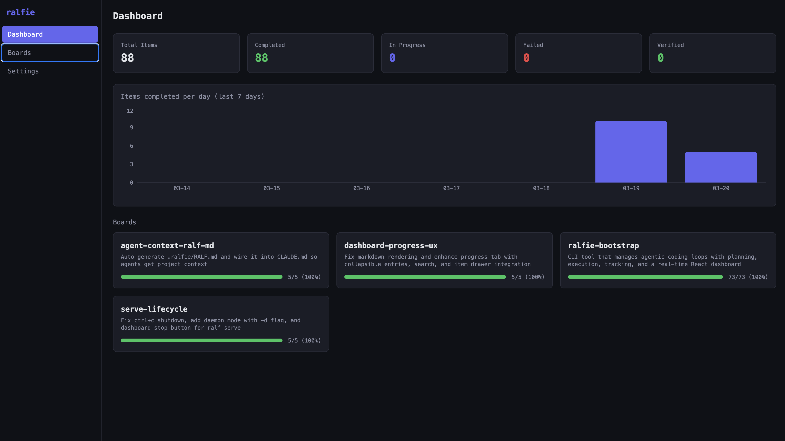
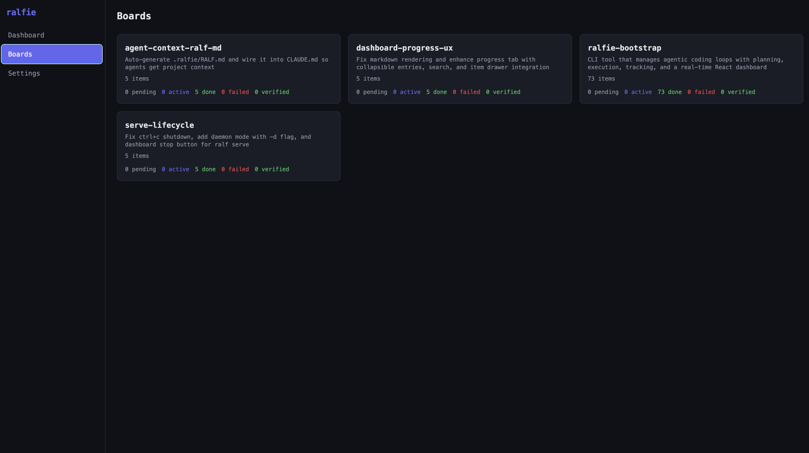
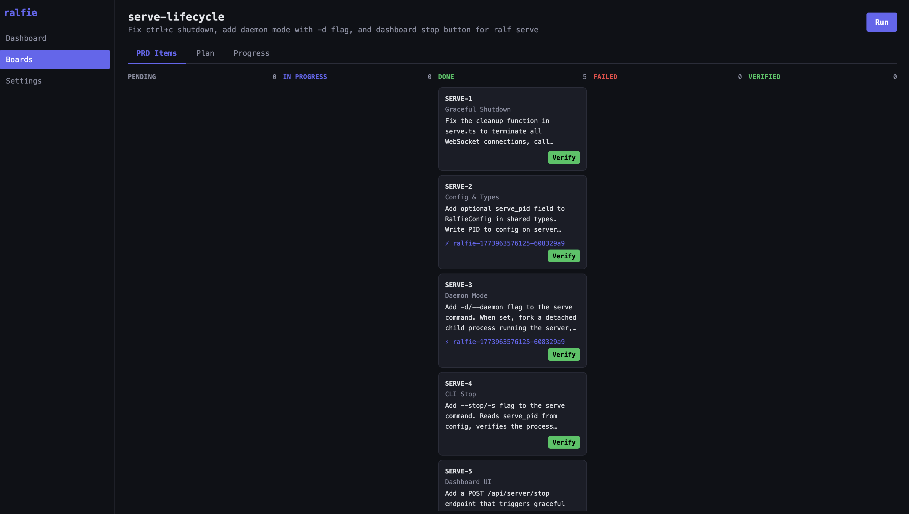

# Ralfie

**Autonomous coding, managed.**

Ralfie turns a product spec into working code — one task at a time, fully automated.

<p align="center">
  
</p>

## What is Ralfie?

You describe what you want built. Ralfie breaks it into tasks, writes a plan, and then executes each task using an AI coding agent — committing real code to your repo along the way.

Think of it as a project manager for your AI coding assistant. Instead of babysitting a single prompt, you define a board (a set of tasks with acceptance criteria), and Ralfie works through them one by one. It claims a task, implements it, runs your test suite and linter to check its work, logs what it did, and moves on to the next one.

You stay in control: every task has clear verification steps, progress is tracked in your repo, and a live dashboard lets you watch work happen in real time.

## Features

- **Plan from conversation** — Describe what you want in plain English. Ralfie grills you on requirements, then generates a structured plan and task list.
- **Autonomous execution** — Each task is claimed, implemented, verified against feedback loops (tests, typecheck, lint), and committed — no manual intervention needed.
- **Live dashboard** — A real-time web UI shows board progress, task status, and detailed logs. Updates instantly via WebSocket as work happens.
- **File-based tracking** — All state lives in your repo under `.ralfie/`. Plans, task lists, and progress logs are plain Markdown and JSON — easy to review in PRs.
- **Built-in guardrails** — File locking prevents conflicts when multiple agents run. Failed tasks are logged and skipped, not retried in an infinite loop.
- **Edit and iterate** — Change your plan mid-stream. `ralf edit` lets you restructure the board, add items, or adjust scope without starting over.

## Quick Start

### Prerequisites

- [Node.js](https://nodejs.org/) v18 or later
- [Claude Code](https://docs.anthropic.com/en/docs/claude-code) installed and authenticated

### Installation

> `npm install -g ralfie` is coming soon. For now, build from source:

```bash
git clone https://github.com/anthropics/ralfie.git
cd ralfie
npm install
npm run build
npm link --workspace=cli
```

### Create your first board

**1. Initialize Ralfie in your project**

```bash
cd your-project
ralf init
```

This creates a `.ralfie/` directory with configuration and skills.

**2. Plan a board**

```bash
ralf plan
```

Ralfie opens an interactive session where you describe what you want built. It asks clarifying questions, then generates a structured plan (`plan.md`) and task list (`prd.json`).

**3. Run the board**

```bash
ralf run <board-name>
```

Ralfie works through tasks one by one — claiming each task, implementing it, running your feedback loops (tests, typecheck, lint), and committing the result.

**4. Watch progress in the dashboard**

```bash
ralf serve
```

Opens a live web dashboard at `http://localhost:3333` where you can see board progress, task status, and detailed logs updating in real time.

## CLI Reference

| Command | Description |
|---------|-------------|
| `ralf init` | Create `.ralfie/` directory with config and skills |
| `ralf plan` | Start an interactive session to create a new board |
| `ralf edit <board>` | Modify an existing board's plan and tasks |
| `ralf run <board> [iterations]` | Execute tasks autonomously (default iterations from config) |
| `ralf list` | Show all boards with progress bars |
| `ralf status <board> <status>` | Filter tasks by status (pending, in_progress, done, failed) |
| `ralf verify <board> <item-id>` | Mark a completed task as verified |
| `ralf unlock <board>` | Clear lockfiles if a run was interrupted |
| `ralf serve` | Start the live dashboard (HTTP + WebSocket on port 3333) |

## Dashboard

The Ralfie dashboard gives you real-time visibility into board progress without leaving your browser.

<p align="center">
  
  <br />
  <em>Dashboard overview — progress charts and status summaries across all boards</em>
</p>

<p align="center">
  
  <br />
  <em>Boards list — browse boards with progress bars and quick navigation</em>
</p>

<p align="center">
  
  <br />
  <em>Kanban view — task cards organized by status with detailed progress logs</em>
</p>

## Architecture

Ralfie is a monorepo with three workspaces:

```
ralfie/
├── shared/    TypeScript types shared across CLI and UI
├── cli/       Node.js CLI (ralf) built with Commander
│   ├── commands/   CLI command handlers
│   ├── lib/        Core modules (config, PRD, board, locking, agent)
│   ├── server/     HTTP server, REST API, WebSocket broadcaster, file watcher
│   └── skills/     Bundled skill markdown files
└── ui/        React SPA (Vite + Tailwind + recharts)
    ├── components/  Dashboard widgets, kanban board, charts
    └── pages/       Dashboard, BoardList, BoardDetail, Settings
```

**Data flow:**

1. **`ralf init`** — creates a `.ralfie/` directory in your project with config and skills
2. **`ralf plan`** — spawns an interactive Claude Code session that generates a plan (`plan.md`) and task list (`prd.json`)
3. **`ralf run`** — picks up tasks one by one, claims each via file lock, implements it, runs feedback loops, commits the result
4. **`ralf serve`** — watches `.ralfie/boards/` for file changes and broadcasts updates over WebSocket to the React dashboard

## Contributing

Ralfie is in early alpha — the architecture is settling, the API is evolving, and there's a lot of room to shape how this thing works. That means now is a great time to get involved.

Here's how you can help:

- **Star the repo** to help others find it
- **Fork and experiment** — try Ralfie on your own projects and see what breaks
- **Open issues** for bugs, rough edges, or ideas you'd like to see
- **Submit PRs** — whether it's a typo fix or a new feature, contributions are welcome

```bash
git clone https://github.com/anthropics/ralfie.git
cd ralfie
npm install
npm run build
npm test
```

## License

MIT
